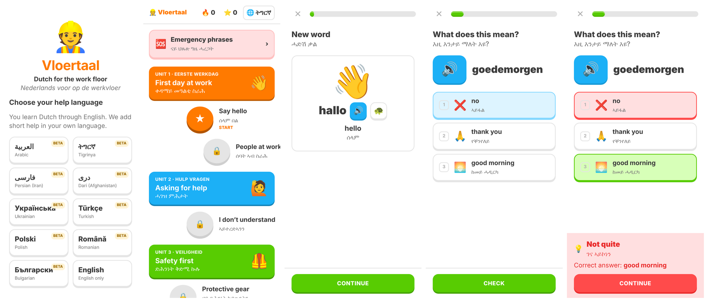
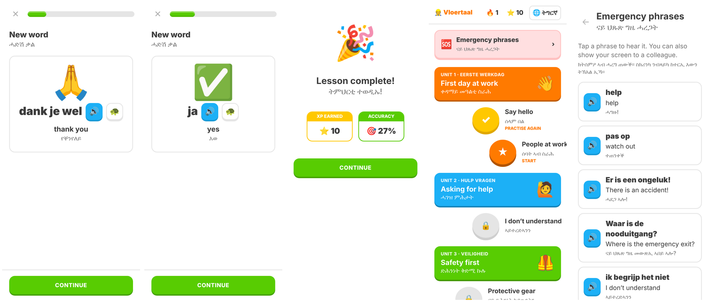

# 👷 Vloertaal

**Nederlands voor op de werkvloer — geleerd via Engels, met hulp in je eigen taal.**

Vloertaal is een webapp in de stijl van Duolingo voor mensen die in Nederland (gaan) werken
in logistiek, land- en tuinbouw, productie of uitzendwerk. Engels is de brugtaal: de app zelf
is Engels, en onder elke uitleg verschijnt een korte vertaling in de *hulptaal* van de leerling.

| Hulptaal | Voor wie |
|---|---|
| العربية Arabisch (Modern Standaard) | Syrië, Irak, Marokko — MSA zodat iedereen het begrijpt |
| ትግርኛ Tigrinya | Eritrea — vrijwel geen lesmateriaal beschikbaar |
| فارسی Perzisch | Iran |
| دری Dari | Afghanistan — eigen variant, niet Iraans Perzisch |
| Українська Oekraïens | ontheemden met tijdelijke bescherming |
| Türkçe Turks | bestaande gemeenschap en nieuwe instroom |
| Polski Pools, Română Roemeens, Български Bulgaars | arbeidsmigranten |
| English only | iedereen met een andere taal |




## Wat zit erin

- **Lespad** met 6 units / 10 lessen: eerste werkdag, hulp vragen, veiligheid (PBM, gevaar),
  magazijn, rooster en ziekmelden, de kas. Lessen worden één voor één vrijgespeeld.
- **7 oefentypen**: nieuw woord (met plaatje en uitspraak), betekenis kiezen, Nederlands woord kiezen,
  luisteren en kiezen, paren verbinden, zin bouwen met woordtegels, typen wat je hoort.
- **Toegankelijk**: grote knoppen, plaatjes bij elk woord, alles kan worden voorgelezen (🔊 en 🐢 langzaam),
  vergevingsgezind bij typen (hoofdletters, lidwoord, één tikfout), rechts-naar-links voor Arabisch/Perzisch/Dari,
  "kan nu niet luisteren"-knop, `prefers-reduced-motion`, geen account nodig.
- **Motiverend**: XP, dagelijkse streak 🔥, kroon 👑 bij een foutloze les, geluidjes en feedbackbalk.
  Fouten komen aan het eind van de les nog één keer terug.
- **Noodzinnen** 🆘: altijd bereikbaar, ook vóór je lessen hebt gedaan ("Er is een ongeluk!", "Ik begrijp het niet").
- **Werkt offline** na het eerste bezoek (PWA, installeerbaar op de telefoon). Voortgang staat lokaal op het toestel.

## Starten

```bash
npm install
npm run dev      # ontwikkelserver op http://localhost:5173
npm test         # unit tests (logica + volledigheid van alle vertalingen)
npm run build    # productiebuild in dist/
```

Bij een push naar `main` draait `.github/workflows/deploy.yml` de tests en publiceert de app op
GitHub Pages (zet in de repo-instellingen *Pages → Source* op *GitHub Actions*).

## Structuur

```
src/content/curriculum.ts   alle lessen: woorden en zinnen (NL + EN + emoji), met vaste id's
src/i18n/<taal>.ts          per hulptaal: UI-teksten en vertalingen per id
src/lib/exercises.ts        stelt een les samen uit woorden en zinnen
src/lib/answers.ts          antwoordcontrole (normaliseren, tikfouten)
src/lib/progress.ts         XP, streak, voltooide lessen (localStorage)
src/lib/audio.ts            Nederlandse spraak via de browser + geluidseffecten
src/components/             schermen en oefeningen
```

**Les toevoegen:** voeg een `Lesson` toe in `curriculum.ts` en vul in elk `src/i18n/*.ts` de nieuwe id's aan.
`npm test` faalt zolang er in een taal iets ontbreekt.

**Taal toevoegen:** kopieer een bestaand bestand in `src/i18n/`, vertaal, en voeg het toe aan `helpLanguages`
in `src/i18n/index.ts` (en aan het type `LangCode`).

## ⚠️ Vertalingen moeten nog worden gecontroleerd

Alle hulptaal-teksten zijn met AI geschreven en staan op `reviewed: false` (in de app zichtbaar als **beta**).
Laat ze nakijken door moedertaalsprekers vóór je de app aan leerlingen geeft. Zie
[`docs/vertaalcontrole.md`](docs/vertaalcontrole.md) voor de punten die het meest aandacht nodig hebben —
vooral **Tigrinya** (hele bestand) en **Dari**.

## Ideeën voor de volgende stap

- Sector kiezen bij de start (logistiek, tuinbouw, schoonmaak, bouw, zorg) en het lespad daarop afstemmen.
- Echte audio-opnames in plaats van browser-spraak (niet elk toestel heeft een Nederlandse stem).
- Mannelijke/vrouwelijke varianten in de hulptalen ("ik ben nieuw" verschilt per geslacht in o.a. Arabisch, Pools, Oekraïens).
- Spraakherkenning voor uitspraakoefeningen.
- Werkgeversdashboard: groepen aanmaken, voortgang van medewerkers zien, eigen bedrijfswoorden toevoegen.
- Account/sync zodat voortgang niet verloren gaat bij een nieuw toestel.
